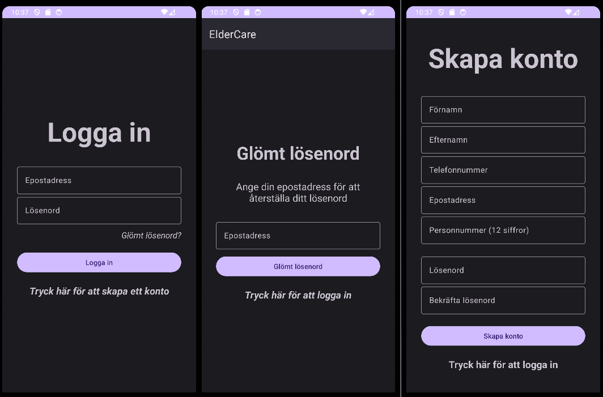
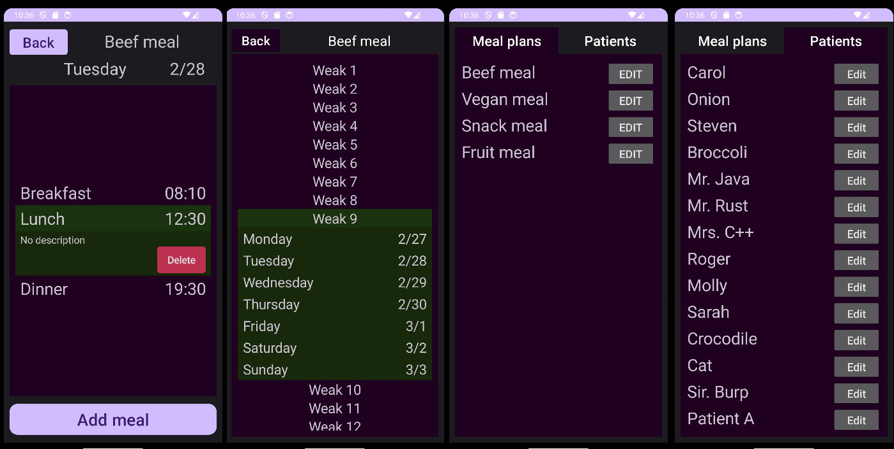

# Elder Care
Android Studio, Java, Firebase

# Git tutorial

Stage: ```git add .```

Commit: ```git commit -m "Meddelande"```

Push: ```git pull``` kan behövas innan ```git push```

Ändra branch: ```git checkout <branch-namn>```

Skapa branch: ```git checkout -b <branch-namn>```

## Login/register UI


## Meal management UI

